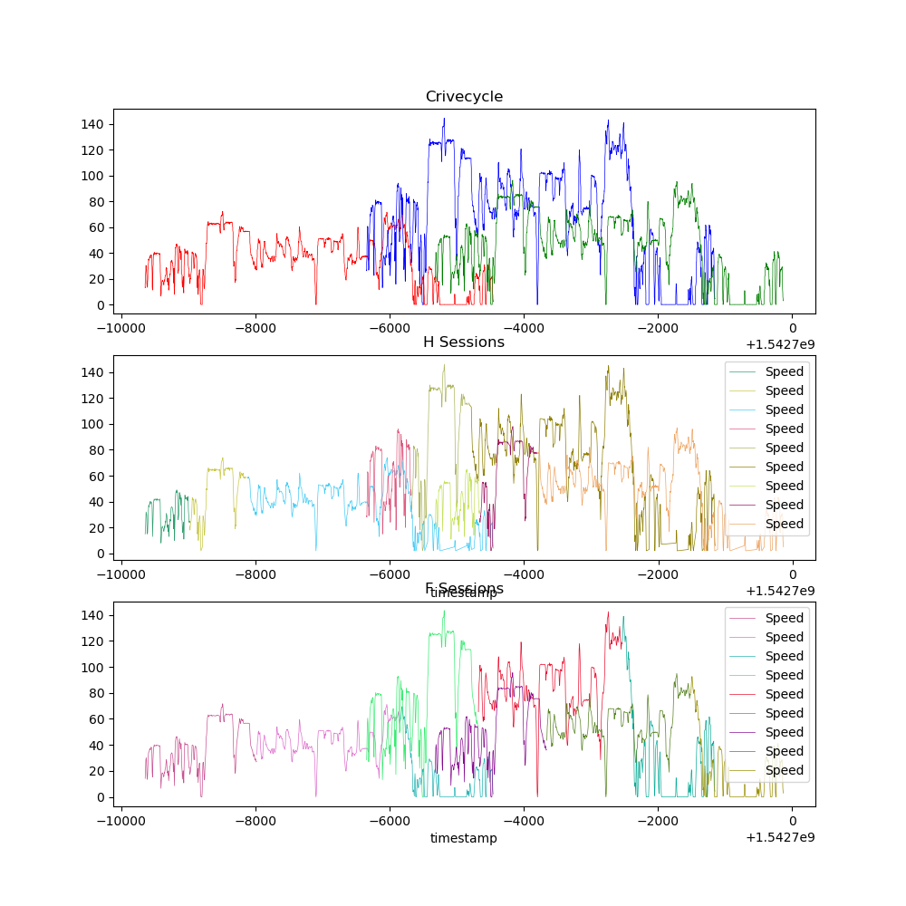

<h3 align="center">Create variations of a time series data</h3>

Take a time series and create variation of it based on a configuration.

Sample configuration:

    dataframe=original_series,
    x_dimension="timestamp",
    y_dimension="y",
    mean_every_seconds=5,
    y_noise_function=lambda speed: speed + (random.gauss(0, 0.01)),
    x_noise_function=lambda t: t + (random.gauss(0, 2)),
    p_new_block_per_second=1.86e-4,
    p_data_point_lost=0.02,
    decimals=2,
    on_changes=False

Input a pandas dataframe (in this case "original_series") and use the column "timestamp" as x- and the column "y" as y-Axes.

* Group every *mean_every_seconds* seconds.
* Create a new block id with the probability of *p_new_block_per_second* per second
* Apply the noise function *y_noise_function* on the y axis
* Apply the noise function *x_noise_function* on the x axis
* drop a data point with the propability of *p_data_point_lost*
* Round to *decimals* decimals
* Filter out all records with to change if *on_changes* is set true

main.py creates 3 drivecycle based on the sample data:
Sample series:

